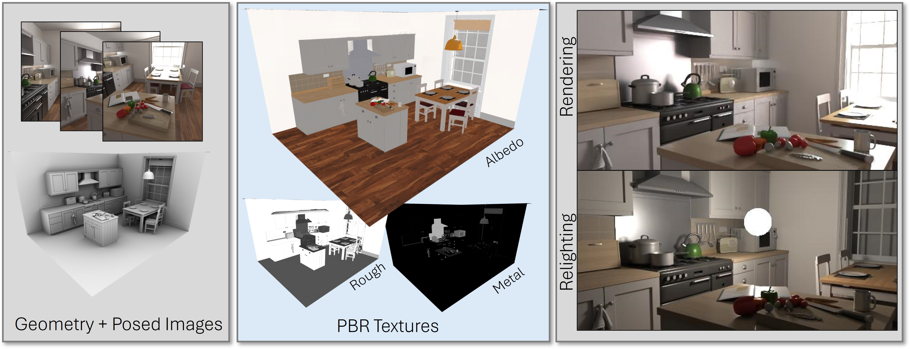

<p align="center">

  <h1 align="center">Intrinsic Image Fusion for Multi-View 3D Material Reconstruction</h1>
  <p align="center">
    <a href="https://peter-kocsis.github.io/">Peter Kocsis</a>
    ·
    <a href="https://lukashoel.github.io/">Lukas Höllein</a>
    ·
    <a href="https://niessnerlab.org/members/matthias_niessner/profile.html">Matthias Nießner</a>
  </p>
  <h2 align="center">CVPR 2026</h2>
  <h3 align="center"><a href="https://arxiv.org/abs/2512.13157">Paper</a> | <a href="https://peter-kocsis.github.io/IntrinsicImageFusion/">Project Page</a> </h3>
  <div align="center"></div>
</p>

<p align="center">
  <a href="">
    
  </a>
</p>

<p align="center">
We introduce Intrinsic Image Fusion, a method that reconstructs high-quality physically based materials from multi-view images.
Material reconstruction is highly underconstrained and typically relies on analysis-by-synthesis, which requires expensive and noisy path tracing. 
To better constrain the optimization, we incorporate single-view priors into the reconstruction process. 
We leverage a diffusion-based material estimator that produces multiple, but often inconsistent, candidate decompositions per view.
To reduce the inconsistency, we fit an explicit low-dimensional parametric function to the predictions.
We then propose a robust optimization framework using soft per-view prediction selection together with confidence-based soft multi-view inlier set to fuse the most consistent predictions of the most confident views into a consistent parametric material space. 
Finally, we use inverse path tracing to optimize for the low-dimensional parameters. 
Our results outperform state-of-the-art methods in material disentanglement on both synthetic and real scenes, producing sharp and clean reconstructions suitable for high-quality relighting.
</p>
<br>


## Structure
Our project has the following structure:

```
├── docs                  <- Project page
├── data                  <- Data folder
├── configs               <- Pipeline configs
├── iif                   <- Our main package for Intrinsic Image Fusion
├── outputs               <- Pipeline outputs
├── scripts               <- Folder to store the scripts
├── environment.yaml      <- Env file for creating conda environment
├── LICENSE
└── README.md
```

# Installation
To install the dependencies, you can use the provided environment file. Please ensure that you have the `CUDA_HOME` and the `LD_LIBRARY_PATH` variable set in order to install [TinyCudaNN](https://github.com/nvlabs/tiny-cuda-nn).
```
conda env create -f environment.yaml
conda activate iif
```

# Data
We provide our pre-processed scenes for the kitchen, bedroom, livingroom and bathroom synthetic scenes. The dataset contains rendered images of all modalities, as well as the scene in Mitsuba and Blender formats. You can download them with the following commands:
```
for item in indoor_synthetic/kitchen.zip indoor_synthetic/bedroom.zip indoor_synthetic/livingroom.zip indoor_synthetic/bathroom.zip; do
  mkdir -p data/${item%.*}
  wget "https://kaldir.vc.cit.tum.de/intrinsix/${item}" -O "data/${item}"
  unzip "data/${item}" -d data/${item%.*}/..
  rm "data/${item}"
done
```

# Logging
Some of our stages are using [W&B](https://wandb.ai/site/) for logging. You can disable it in the resepctive config files, or adjust the `configs/component/logger/wandb.yaml` file.

# Pipeline
Our project consists of multiple stages, as described below. We provide scripts that run all the stages consecutively, but you can also run the specific stages one-by-one and adjust the configurations to your needs. The full script will skip those stages that has been already finished. If parallel evaluation is available, we recommend to run the first stage (single-view predictions) separately on multiple threads to speed up the process. You can run the provided scripts directly with bash, or also on clusters (we provide SLURM job files). 

Before running any job files, please check the `scripts/bash.job` and `scripts/python.job` files for the logging and submission settings. 

To run the full pipeline on SLURM:

```
sbatch --export=ALL,SCRIPT_PATH="./scripts/pipeline.sh",SCENE_NAME="kitchen" --mem=64GB --cpus-per-gpu=8 scripts/bash.job
```

## 0 - Pre-processing
Following [IRIS](https://github.com/facebookresearch/iris), we first pre-calculate a surface light field cache. 

```
python -m iif.job task=0_baking_slf/v0_iris_init component/scene@task.scene=$SCENE_TYPE/$SCENE_NAME paths.out_name=$OUT_DIR $SLF_ARGS
```

## 1 - Single-View Predictions
Our first stage generates 16 material predictions for every image in the scene. This is the most compute intensive step; thus, we recommend to run this stage in parallel if possible. The script is thread safe, you can start multiple instances at the same time. In case of a SLURM (16 processes):

```
sbatch --export=ALL,SCRIPT_PATH="iif.job",SCRIPT_ARGUMENTS="task=1_single_view_prediction/v2_rgbx component/scene@task.scene=$SCENE_TYPE/$SCENE_NAME" --mem=22GB --cpus-per-gpu=3 --array=0-15 scripts/python.job
```

## 2 - Multi-View Fusion
### 2.1 - Fusing Semantic Predictions
The first step of our fusion is to obtain a 3D consistent semantic segmentation. 

```
python -m iif.job task=2_aggregation/segmentation/v1_gt component/scene@task.scene=$SCENE_TYPE/$SCENE_NAME paths.out_name=$OUT_DIR $AGGREGATE_SEGMENTATION_ARGS"
```

### 2.2 - Fusing Material Predictions
The key step of our fusion is to obtain 3D consistent base materials. 

```
python -m iif.job task=2_aggregation/v5_cm_soft_fullmat component/scene@task.scene=$SCENE_TYPE/$SCENE_NAME paths.out_name=$OUT_DIR $AGGREGATE_PRED_ARGS
```

## 3 - Inverse Rendering
### 3.1 - Emitter Initialization
The next phase after the fusion is inverse rendering. First, we initialize the emitters, similar to [FIPT](https://jerrypiglet.github.io/fipt-ucsd/).

```
python -m iif.job task=3_get_emitter/v0_iris_init component/scene@task.scene=$SCENE_TYPE/$SCENE_NAME paths.out_name=$OUT_DIR $EMITTER_INIT_ARGS
```

### 3.2 - Emitter Refinement
The second step of our lighting estimation is to obtain HDR emission values. Following [IRIS](https://github.com/facebookresearch/iris), we optimize for emission parameters given the coarse base materials. 

```
python -m iif.job task=3_inverse_rendering/lighting/v0_2_iris_ldr component/scene@task.scene=$SCENE_TYPE/$SCENE_NAME paths.out_name=$OUT_DIR $EMITTER_OPTIMIZATION_ARGS
```

### 3.3 - Shading Cache
To speed up the material refinement, we cache the shading.

```
python -m iif.job task=3_inverse_rendering/shading/v0_2_iris_ldr component/scene@task.scene=$SCENE_TYPE/$SCENE_NAME paths.out_name=$OUT_DIR $EMITTER_OPTIMIZATION_ARGS
```

### 3.4 - BRDF and CRF Refinement
Given the lighting, we optimize for the free parameters of our material representation and also for the camera response function. 

```
python -m iif.job task=3_inverse_rendering/material/v0_2_iris_ldr component/scene@task.scene=$SCENE_TYPE/$SCENE_NAME paths.out_name=$OUT_DIR $BRDF_OPTIMIZATION_ARGS
```

## 4 - Rendering
Given the full decomposition, we rerender all the modalities from all the input views.

```
python -m iif.job task=4_render/v0_render component/scene@task.scene=$SCENE_TYPE/$SCENE_NAME paths.out_name=$OUT_DIR $RENDER_ARGS
```

## 5 - Metrics
We calculate metrics for the synthetic scenes. E.g.:

```
python -m iif.job task=5_metrics/v0_albedo component/scene@task.scene=$SCENE_TYPE/$SCENE_NAME paths.out_name=$OUT_DIR
```


# Acknowledgements
This project is built upon [IRIS](https://github.com/facebookresearch/iris) and [FIPT](https://jerrypiglet.github.io/fipt-ucsd/). 
Our datageneration was inspired by the [FIPT Dataset](https://github.com/Jerrypiglet/rui-indoorinv-data).
Our rendering script uses [Mitsuba 3](https://github.com/mitsuba-renderer/mitsuba3). 

# Citation
If you find our code or paper useful, please cite as
```bibtex
@article{kocsis2025iif,
  author    = {Kocsis, Peter and H\"{o}llein, Lukas and Nie\{ss}ner, Matthias},
  title     = {Intrinsic Image Fusion for Multi-View 3D Material Reconstruction},
  journal   = {Conference on Computer Vision and Pattern Recognition (CVPR)},
  year      = {2026},
}
```